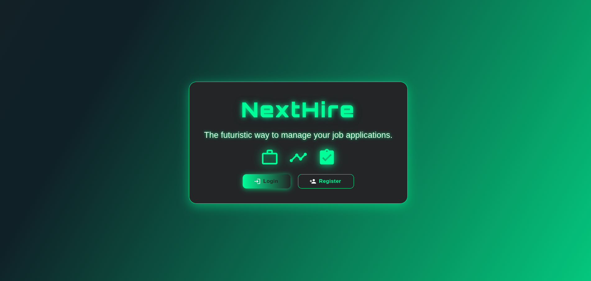
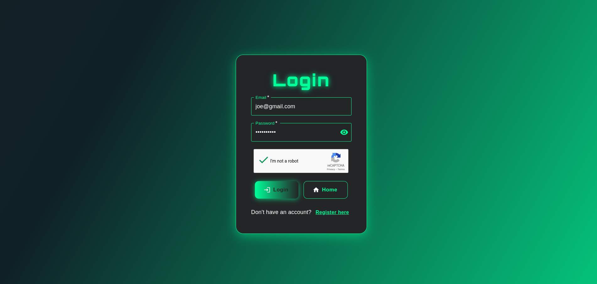
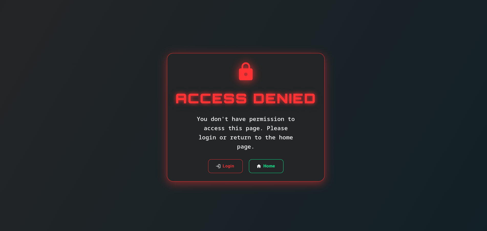

# Job Application App 📑💼

## Project Overview
A full-stack, security-focused application to track job applications, featuring a robust REST API (Node.js/Express/MongoDB) and a modern React frontend.

---

## Features
### Backend
- **Express Server**: Secure API with authentication, rate limiting, 2FA, and attempt tracking.
- **REST API**: Endpoints for users and job applications.
- **MongoDB**: NoSQL database for persistence.
- **Security**: Input sanitization, detection of malicious input (XSS, SQLi, etc), Telegram alerts, and strong access control.
- **Middlewares**: Authentication, login attempt tracking, 2FA, and malicious input detection.

### Frontend
- **React**: Modern SPA with protected navigation.
- **Material UI**: Responsive, stylish UI.
- **Authentication Management**: Registration, login, verification, input blocking, and access control.

---

## Screenshots

### Home Page


### Successful Registration


### Login Page


### Job Applications Dashboard


### Access Denied


### Input Blocked (Malicious Input)


---

## Security Highlights
- **Input Sanitization**: All user input is sanitized on the backend to prevent XSS, SQL injection, and other attacks.
- **Malicious Input Detection**: Attempts to submit dangerous code or patterns are blocked and tracked. After 3 attempts, the user is temporarily blocked.
- **2FA**: Two-factor authentication is required for sensitive actions.
- **Rate Limiting**: Prevents brute-force and abuse.
- **Telegram Alerts**: Security events (e.g., repeated malicious input) trigger instant Telegram notifications to the admin.
- **Access Control**: Users can only access their own data; unauthorized access attempts are denied.

---

## Project Structure
```
backend/
  models/           # Mongoose models (User, Job)
  routes/           # Express routes (userRoutes, jobRoutes)
  middlewares/      # Security middlewares
  utils/            # Utilities (argon, telegram)
  db.js             # MongoDB connection
  index.js          # Entry point
frontend/
  src/
    components/     # React components (Login, Register, Profile, etc)
    App.js          # Root component
    index.js        # Entry point
  public/           # index.html, manifest
imgs/               # Screenshots for documentation
```

---

## Getting Started
### Prerequisites
- Node.js >= 18
- MongoDB (local or Atlas)

### Installation
1. Clone the repository:
    ```sh
    git clone https://github.com/hugo8072/Job_Application_App
    cd Job_Application_App
    ```
2. Install backend and frontend dependencies:
    ```sh
    cd backend && npm install
    cd ../frontend && npm install
    ```
3. Create the `.env` file in `backend/`:
    ```dotenv
    PORT=8000
    MONGO_URL=mongodb+srv://<username>:<password>@cluster0.mongodb.net/
    JWT_SECRET_KEY=your_secret_key
    DB_NAME=job_app_db
    ```

### Running
- **Backend:**
    ```sh
    cd backend
    npm start
    ```
- **Frontend:**
    ```sh
    cd frontend
    npm start
    ```

---

## API Endpoints (Main)
- `GET /api/users` — List users
- `POST /api/users/register` — Register
- `POST /api/users/login` — Login
- `POST /api/users/verify` — 2FA
- `GET /api/jobs` — List job applications
- `POST /api/jobs` — Create job application

---

## Contribution
Contributions are welcome! Fork and submit a pull request.

## License
MIT


